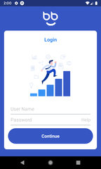

# Example Login Screen with React Native

Login screen for Android and iOS using React Native. The layout was inspired by [Onbbi v9 Tomer](https://www.sketchappsources.com/free-source/3909-concept-game-app-sketch-freebie-resource.html).



You can view the App also by **Expo**.
Just download the **Expo** application on your cell phone, [click here](https://expo.io/) and scan the QRCode of the open page in your downloaded application.

## Getting Started :+1:
First we'll clone the project:
```shell
$ git clone https://github.com/gustafsilva/example-login-screen-with-react-native.git
```

Enter the folder of the cloned project, enter its dependencies, and start the development server:
```shell
$ cd example-login-screen-with-react-native/
$ npm install
$ npm start
```

A screen in your browser will open, you can open the App in an android or ios emulator.
Or scan the QR Code using the Expo Application directly on your celebrular.

## Main Available Scripts :fire:

In the project directory, you can run:

### `npm start`

Start a development server using the expo.

### `npm run lint`

Performs an analysis of all code in mass `./src` with a linter.
Standard used in the project is **Airbnb**, more information [click here](https://github.com/airbnb/javascript).

## Main Used Techologies :rocket:

- [React](http://reactjs.org)
- [React Native](https://facebook.github.io/react-native/)
- [styled-components](http://styled-components.com/)
- [Expo](https://expo.io/)
- [ESlint](https://eslint.org/)

## License
The contents of this repository are covered under the [MIT License](./LICENSE).